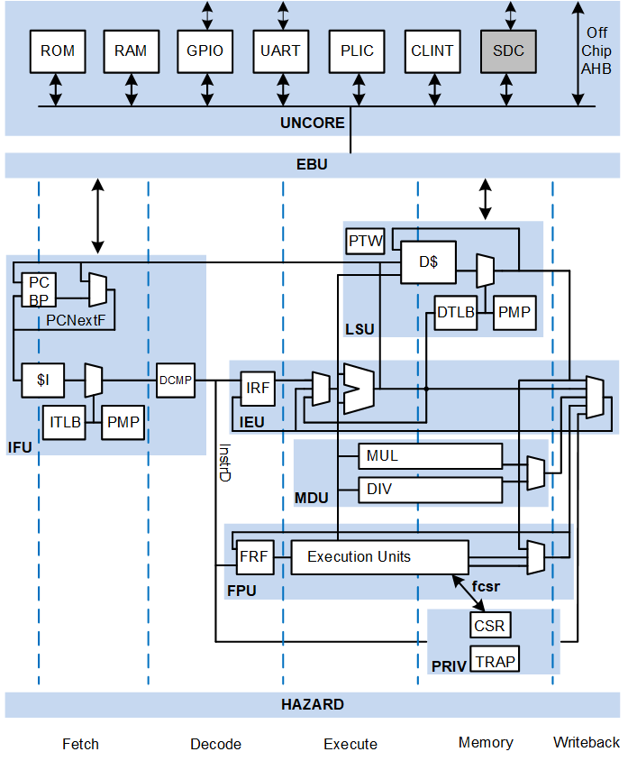

[](https://github.com/openhwgroup/cvw/actions/workflows/install.yml)

# core-v-wally

Wally is a 5-stage pipelined processor configurable to support all the standard RISC-V options, including RV32/64, A, B, C, D, F, M, Q, and Zk* extensions, virtual memory, PMP, and the various privileged modes and CSRs. It provides optional caches, branch prediction, and standard RISC-V peripherals (CLINT, PLIC, UART, GPIO).   Wally is written in SystemVerilog.  It passes the [RISC-V Arch Tests](https://github.com/riscv-non-isa/riscv-arch-test) and boots Linux on an FPGA.  Configurations range from a minimal RV32E core to a fully featured RV64GC application processor with all of the RVA22S64 profile extensions. Wally is part of the OpenHWGroup family of robust open RISC-V cores.



Wally is described in an upcoming textbook, *RISC-V System-on-Chip Design*, by Harris, Stine, Thompson, and Harris.  Users should follow the setup instructions below.  A system administrator must install CAD tools using the directions further down.

# Verification

Wally is presently at Technology Readiness Level 4, passing the RISC-V compatibility test suite and custom tests, and booting Linux in simulation and on an FPGA.  See the [Test Plan](docs/testplans/testplan.md) for details.

# New User Setup

New users may wish to do the following setup to access the server via a GUI and use a text editor.

- Git started with Git configuration and authentication: C.1  (replace with your name and email)
	```bash
	$ git config --global user.name "Ben Bitdiddle"
	$ git config --global user.email "ben_bitdiddle@wally.edu"
	$ git config --global pull.rebase false
	```
- Optional: Download and install x2go - B.1.1
- Optional: Download and install VSCode - B.4.2
- Optional: Make sure you can log into your server via x2go and via a terminal
	- Terminal on Mac, cmd on Windows, xterm on Linux
	- See B.1 about ssh -Y login from a terminal

Then fork and clone the repo, source setup, make the tests and run regression

1. If you don't already have a Github account, create one
2. In a web browser, visit https://github.com/openhwgroup/cvw
3. In the upper right part of the screen, click on Fork
4. Create a fork, choosing the owner as your github account and the repository as cvw.
5. On the Linux computer where you will be working, log in.
6. Clone your fork of the repo. Change `<yourgithubid>` to your github id.
	```bash
	$ git clone --recurse-submodules https://github.com/<yourgithubid>/cvw
	$ cd cvw
	$ git remote add upstream https://github.com/openhwgroup/cvw
	```

> [!NOTE]
> If you are installing on a new system without any tools installed, please jump to the next section, [Toolchain Installation](#toolchain-installation-and-configuration-sys-admin), then come back here.

7. Run the setup script to update your `PATH` and activate the python virtual environment.

	```bash
	$ source ./setup.sh
	```

8. Add the following lines to your `.bashrc` or `.bash_profile` to run the setup script each time you log in.

	```bash
	if [ -f ~/cvw/setup.sh ]; then
		source ~/cvw/setup.sh
	fi
	```

9. Try compiling the HelloWally program and simulating it on the SystemVerilog with Verilator and on the Spike simulator.
	```
	$ cd examples/C/hello
	$ make
	$ wsim --sim verilator rv64gc --elf hello
	Hello Wally!
	0 1 2 3 4 5 6 7 8 9 
	$ spike hello
	Hello Wally!
	0 1 2 3 4 5 6 7 8 9 
	```

10. Build the tests from the cvw directory and run a regression simulation to prove everything is installed.  Building tests may take a while.

	```bash
	$ cd ~/cvw && make --jobs
	$ regression-wally
	```

# Toolchain Installation and Configuration (Sys Admin)

> This section describes the open source toolchain installation.

### Compatibility
The current version of the toolchain has been tested on Ubuntu (versions 20.04 LTS, 22.04 LTS, and 24.04 LTS), Debian (versions 11 and 12), Red Hat/Rocky/AlmaLinux (versions 8 and 9),
and SUSE version 15.6. Only the latest minor release of each major version is tested.

> [!WARNING]
> - Ubuntu 22.04LTS is incompatible with Synopsys Design Compiler.
> - Verilator currently fails to simulate correctly on Ubuntu 20.04 LTS and Red Hat/Rocky/AlmaLinux 8.

### Overview
The toolchain installation script installs the following tools:
- [RISC-V GNU Toolchain](https://github.com/riscv-collab/riscv-gnu-toolchain): GCC and accompanying compiler tools
- [elf2hex](https://github.com/sifive/elf2hex): executable file to hexadecimal converter
- [QEMU](https://www.qemu.org/docs/master/system/target-riscv.html): emulator
- [Spike](https://github.com/riscv-software-src/riscv-isa-sim): functional RISC-V model
- [Verilator](https://github.com/verilator/verilator): open-source Verilog simulator
- [RISC-V Sail Model](https://github.com/riscv/sail-riscv): golden reference model for RISC-V
- [OSU Skywater 130 cell library](https://foss-eda-tools.googlesource.com/skywater-pdk/libs/sky130_osu_sc_t12): standard cell library
- [RISCOF](https://github.com/riscv-software-src/riscof.git): RISC-V compliance test framework

Additionally, Buildroot Linux is built for Wally and linux test-vectors are generated for simulation. See the [Linux README](linux/README.md) for more details. This can be skipped using the `--no-buildroot` flag.

### Installation

The tools can be installed by running

```bash
$ $WALLY/bin/wally-tool-chain-install.sh
```
If this script is run as root or using `sudo`, it will also install all of the prerequisite packages using the system package manager. The default installation directory when run in this manner is `/opt/riscv`.

If a user-level installation is desired, the script can instead be run by any user without `sudo` and the installation directory will be `~/riscv`. In this case, the prerequisite packages must first be installed by running

```bash
$ sudo $WALLY/bin/wally-package-install.sh
```

In either case, the installation directory can be overridden by passing the desired directory as the last argument to the installation script. For example,

```bash
$ sudo $WALLY/bin/wally-tool-chain-install.sh /home/riscv
```

See `wally-tool-chain-install.sh` for a detailed description of each component, or to issue the commands one at a time to install on the command line.

> [!NOTE]
> The complete installation process requires ~55 GB of free space. If the `--clean` flag is passed to the installation script then the final consumed space is only ~26 GB, but upgrading the tools will reinstall everything from scratch.

### Configuration
`$WALLY/setup.sh` sources `$RISCV/site-setup.sh`. If the toolchain was installed in either of the default locations (`/opt/riscv` or `~/riscv`), `$RISCV` will automatically be set to the correct path when `setup.sh` is run. If a custom installation directory was used, then `$WALLY/setup.sh` must be modified to set the correct path.

`$RISCV/site-setup.sh` allows for customization of the site specific information such as commercial licenses and PATH variables. It is automatically copied into your `$RISCV` folder when the installation script is run.

Change the following lines to point to the path and license server for your Siemens Questa and Synopsys Design Compiler and VCS installations and license servers.  If you only have Questa or VCS, you can still simulate but cannot run logic synthesis.  If Questa, VSC, or Design Compiler are already setup on this system then don't set these variables.

```bash
export MGLS_LICENSE_FILE=..         # Change this to your Siemens license server
export SNPSLMD_LICENSE_FILE=..      # Change this to your Synopsys license server
export QUESTA_HOME=..               # Change this for your path to Questa
export DC_HOME=..                   # Change this for your path to Synopsys Design Compiler
export VCS_HOME=..                  # Change this for your path to Synopsys VCS
```

# Installing EDA Tools

Electronic Design Automation (EDA) tools are vital to implementations of System on Chip architectures as well as validating different designs.   Open-source and commercial tools exist for multiple strategies and although the one can spend a lifetime using combinations of different tools, only a small subset of tools is utilized for this text.  The tools are chosen because of their ease in access as well as their repeatability for accomplishing many of the tasks utilized to design Wally.  It is anticipated that additional tools may be documented later after this is text is published to improve use and access.

Verilator is an open-source Verilog simulator.  It is fast and free.  Run Wally on the riscv-arch-test suite using Verilator with:

```
regression-wally
```

Running code or functional coverage simulations or lock-step presently require commercial tools.  Siemens Questa is the primary tool utilized for simulating and validating Wally. Synopsys VCS also can run regression-wally and lock-step simulation.  For logic synthesis, you will need Synopsys Design Compiler.  Questa and Design Compiler are commercial tools that require an educational or commercial license.

Note: Some EDA tools utilize `LM_LICENSE_FILE` for their environmental variable to point to their license server.  Some operating systems may also utilize `MGLS_LICENSE_FILE` instead, therefore, it is important to read the user manual on the preferred environmental variable required to point to a user’s license file.  Although there are different mechanisms to allow licenses to work, many companies commonly utilize the FlexLM (i.e., Flex-enabled) license server manager that runs off a node locked license.

Although most EDA tools are Linux-friendly, they tend to have issues when not installed on recommended OS flavors.  Red Hat Enterprise Linux (and its free Rocky clone) and SUSE Linux products  typically tend to be recommended for installing commercial-based EDA tools and are recommended for utilizing complex simulation and architecture exploration.  

### Siemens Questa

Siemens Questa simulates behavioral, RTL and gate-level HDL.  To install Siemens Questa first go to a web browser and navigate to https://eda.sw.siemens.com/en-US/ic/questa/simulation/advanced-simulator/.  Click Sign In and log in with your credentials and the product can easily be downloaded and installed.  Some  Windows-based installations also require gcc libraries that are typically provided as a compressed zip download through Siemens.

### Synopsys Design Compiler (DC)

Many commercial synthesis and place and route tools require a common installer.  These installers are provided by the EDA vendor and Synopsys has one called Synopsys Installer.  To use Synopsys Installer, you will need to acquire a license through Synopsys that is typically Called Synopsys Common Licensing (SCL).  Both the Synopsys Installer, license key file, and Design Compiler can all be downloaded through Synopsys Solvnet.  First open a web browser, log into Synsopsy Solvnet, and download the installer and Design Compiler installation files.  Then, install the Installer.

```bash
$ firefox &
```

- Navigate to https://solvnet.synopsys.com
- Log in with your institution’s username and password
- Click on Downloads, then scroll down to Synopsys Installer
- Select the latest version (currently 5.4).  Click Download Here, agree,
- Click on SynopsysInstaller_v5.4.run
- Return to downloads and also get Design Compiler (synthesis) latest version, and any others you want.
- Click on all parts and the .spf file, then click Download Files near the top
- Move the SynopsysInstaller into `/cad/synopsys/Installer_5.4` with 755 permission for cad,
- move other files into `/cad/synopsys/downloads` and work as user cad from here on

```bash
$ cd /cad/synopsys/installer_5.4
$ ./SynopsysInstaller_v5.4.run
```
- Accept default installation directory
```bash
$ ./installer
```
- Enter source path as `/cad/synopsys/downloads`, and installation path as `/cad/synopsys`
- When prompted, enter your site ID
- Follow prompts

Installer can be utilized in graphical or text-based modes.  It is far easier to use the text-based installation tool.  To install DC, navigate to the location where your downloaded DC files are and type installer.  You should be prompted with questions related to where you wish to have your files installed.

The Synopsys Installer automatically installs all downloaded product files into a single top-level target directory. You do not need to specify the installation directory for each product. For example, if you specify `/import/programs/synopsys` as the target directory, your installation directory structure might look like this after installation:

```bash
/import/programs/synopsys/syn/S-2021.06-SP1
```

> [!Note]
> Although most parts of Wally, including the Questa simulator, will work on most modern Linux platforms, as of 2024, the Synopsys CAD tools for SoC design are only supported on Red Hat Enterprise Linux (or AlmaLinux/Rocky) 8.4+ or 9.1+ or SUSE Linux Enterprise Server (SLES) 15.

The Verilog simulation has been tested with Siemens Questa/ModelSim. This package is available to universities worldwide as part of the Design Verification Bundle through the Siemens Academic Partner Program members for $990/year.

If you want to implement your own version of the chip, your tool and license complexity rises significantly. Logic synthesis uses Synopsys Design Compiler. Placement and routing uses Cadence Innovus. Both Synopsys and Cadence offer their tools at a steep discount to their university program members, but the cost is still several thousand dollars per year. Most research universities with integrated circuit design programs have Siemens, Synopsys, and Cadence licenses. You also need a process design kit (PDK) for a specific integrated circuit technology and its libraries. The open-source Google Skywater 130 nm PDK is sufficient to synthesize the core but lacks memories. Google presently funds some fabrication runs for universities. IMEC and Muse Semiconductor offers full access to multiproject wafer fabrication on the TSMC 28 nm process including logic, I/O, and memory libraries; this involves three non-disclosure agreements. Fabrication costs on the order of $10,000 for a batch of 1 mm2 chips.

Startups can expect to spend more than $1 million on CAD tools to get a chip to market. Commercial CAD tools are not realistically available to individuals without a university or company connection.


# Adding Cron Job for nightly builds

If you want to add a cronjob you can do the following:
1) Set up the email client `mutt` to send emails through the command line
2) Enter `crontab -e` into a terminal
3) add this code to test cloning CVW, making CVW's tests, then running `regression-wally --nightly --buildroot` every day at 21:30 in your local time
```bash
30 21 * * * curl -L https://raw.githubusercontent.com/openhwgroup/cvw/refs/heads/main/bin/nightly_build.py | python - --path {PATH_FOR_NIGHTLY_RUNS} --target all --tests all --send_email harris@hmc.edu,rose@rosethompson.net
```
This utility will take up approximately 100 GB on your hard drive. You can also run the script directly from `bin/nightly_build.py`.

# Example wsim commands

wsim runs one of multiple simulators, Questa, VCS, or Verilator using a specific configuration and either a suite of tests or a specific elf file.
The general syntax is
`wsim <config> <suite or elf file> [--options]`

Parameters and options:

```
-h, --help                                                   show this help message and exit
--elf ELF, -e ELF                                            ELF File name; use if name does not end in .elf
--sim {questa,verilator,vcs}, -s {questa,verilator,vcs}      Simulator
--tb {testbench,testbench_fp}, -t {testbench,testbench_fp}   Testbench
--gui, -g                                                    Simulate with GUI
--ccov, -c                                                   Code Coverage
--fcov, -f                                                   Functional Coverage with cvw-arch-verif, implies lockstep
--args ARGS, -a ARGS                                         Optional arguments passed to simulator via $value$plusargs
--params PARAMS, -p PARAMS            			 								 Optional top-level parameter overrides of the form param=value
--define DEFINE, -d DEFINE            											 Optional define macros passed to simulator
--vcd, -v                                                    Generate testbench.vcd
--lockstep, -l                                               Run ImperasDV lock, step, and compare.
--lockstepverbose, -lv                                       Run ImperasDV lock, step, and compare with tracing enabled
--rvvi, -r                                                   Simulate rvvi hardware interface and ethernet.
```

Run basic test with Questa

```bash
wsim rv64gc arch64i
```

Run Questa with gui

```bash
wsim rv64gc wally64priv --gui
```

Run basic test with Verilator

```bash
wsim rv32i arch32i --sim verilator
```

Run lockstep against ImperasDV with a single elf file in the gui. Lockstep requires single elf.

```bash
wsim rv64gc $WALLY/tests/riscof/work/riscv-arch-test/rv64i_m/I/src/add-01.S/ref/ref.elf --lockstep --gui
```

Run lockstep against ImperasDV with a single elf file. Collect functional coverage.

```bash
wsim rv64gc $WALLY/addins/cvw-arch-verif/tests/rv64/Zicsr/WALLY-COV-ALL.elf --fcov
```

Run Linux boot simulation in lock step between Wally and ImperasDV

```bash
wsim buildroot buildroot --args +INSTR_LIMIT=600000000 --lockstep
```
